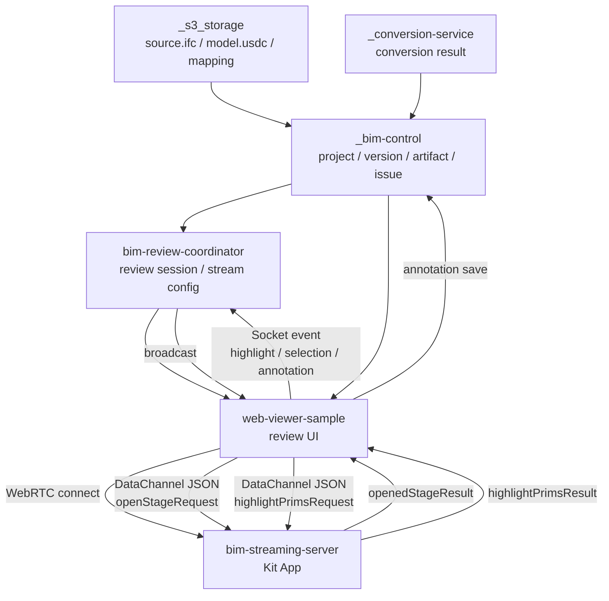

# Other — docs-plans

# Other — docs-plans Module Documentation

## Overview

The **Other — docs-plans** module serves as a comprehensive planning and execution guide for the development of the BIM Review Coordinator and its associated components. This module outlines the foundational architecture, data flows, and responsibilities of various services involved in the BIM review process, specifically focusing on the interaction between the `bim-review-coordinator`, `web-viewer-sample`, and `bim-streaming-server`.

## Purpose

The primary goal of this module is to establish a clear execution plan for integrating the BIM review workflow, ensuring that all components communicate effectively and that the necessary data flows are established. This includes the management of review sessions, artifact handling, and the dynamic interaction between users and the BIM model.

## Key Components

### 1. BIM Review Coordinator

- **Role**: Acts as the session manager, allocating resources and managing participant interactions.
- **Responsibilities**:
  - Create and manage review sessions.
  - Broadcast events related to camera, selection, and annotations using Socket.IO or WebSocket.
  - Provide stream configuration to the `web-viewer-sample`.

### 2. Web Viewer Sample

- **Role**: A browser-based client that serves as the user interface for reviewing BIM models.
- **Responsibilities**:
  - Connect to the AppStreamer and WebRTC stream.
  - Retrieve stream configuration and artifacts from the `bim-control`.
  - Display issues and allow user interactions such as highlighting and focusing on specific model elements.

### 3. BIM Streaming Server

- **Role**: Handles the streaming of the BIM model and manages the rendering of 3D overlays.
- **Responsibilities**:
  - Load USD/USDC stages and respond to WebRTC DataChannel commands.
  - Process highlight and selection requests from the web viewer.

### 4. _bim-control

- **Role**: A mock API that simulates the BIM data authority.
- **Responsibilities**:
  - Store project and model version records.
  - Provide endpoints for querying artifacts and review issues.

### 5. _s3_storage

- **Role**: A fake object storage service that serves static files.
- **Responsibilities**:
  - Store source IFC files, converted USDC files, and related metadata.

### 6. _conversion-service

- **Role**: Manages the conversion of IFC files to USDC format.
- **Responsibilities**:
  - Provide an API for initiating conversion jobs.
  - Generate mapping files and store results in `_s3_storage`.

## Data Flow

The data flow within this module is designed to facilitate seamless communication between the various components. The following diagram illustrates the key interactions:

## Execution Flow

1. **Session Creation**: The `bim-review-coordinator` creates a review session and allocates a Kit instance.
2. **Stream Configuration**: The coordinator retrieves stream configuration from `_bim-control` and provides it to the `web-viewer-sample`.
3. **User Interaction**: Users interact with the web viewer, which sends requests to highlight specific elements in the model.
4. **Highlighting**: The web viewer sends highlight requests to the `bim-streaming-server`, which processes these requests and updates the model view accordingly.
5. **Annotation Management**: Users can create annotations, which are sent back to `_bim-control` for storage.

## Integration with the Codebase

This module connects with several other components in the codebase, including:

- **_bim-control**: Provides the necessary APIs for managing BIM data and artifacts.
- **_s3_storage**: Serves as the storage backend for the files generated during the conversion process.
- **_conversion-service**: Handles the conversion logic and integrates with the `bim-streaming-server` for rendering.
- **bim-streaming-server**: Manages the streaming of the BIM model and responds to user interactions from the web viewer.

## Conclusion

The **Other — docs-plans** module is essential for coordinating the development and integration of the BIM review workflow. By clearly defining the roles and responsibilities of each component, as well as the data flows and interactions, this module ensures that developers can effectively contribute to the project and maintain a cohesive architecture.
