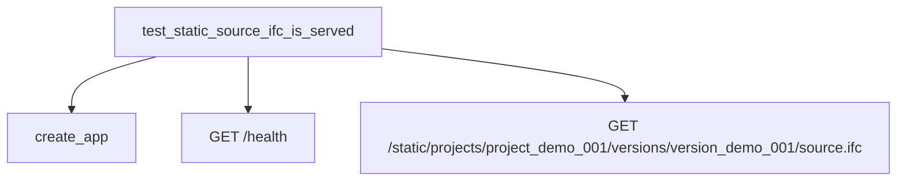

# Other — _s3_storage-tests

# _s3_storage-tests Module Documentation

## Overview

The **_s3_storage-tests** module is designed to provide unit tests for the storage API of the S3 storage system. It primarily focuses on validating the functionality of serving static files, specifically IFC (Industry Foundation Classes) files, through a FastAPI application. This module ensures that the application correctly handles requests for static resources and responds appropriately.

## Purpose

The main purpose of this module is to verify that the FastAPI application can serve static IFC files from a specified directory. It tests the health endpoint and checks if the static files are accessible and correctly returned by the API.

## Key Components

### Test Function

#### `test_static_source_ifc_is_served(tmp_path: Path)`

- **Parameters**:
  - `tmp_path`: A temporary directory provided by pytest for testing purposes.

- **Functionality**:
  - Creates a temporary directory structure to simulate the storage of IFC files.
  - Writes a sample IFC file (`source.ifc`) to the designated path.
  - Initializes a FastAPI test client using the `create_app` function, passing the path to the static root.
  - Sends a GET request to the `/health` endpoint to verify that the application is running.
  - Sends a GET request to retrieve the static IFC file and checks the response status and content.

- **Assertions**:
  - Confirms that the health check returns a status code of 200 and a status message of "ok".
  - Validates that the content of the retrieved IFC file contains the expected string "ISO-10303-21".

## Execution Flow

The execution flow for the test function is straightforward, as it primarily involves setting up the test environment, making HTTP requests, and asserting the responses. There are no complex internal or outgoing calls beyond the interactions with the FastAPI application.

### Call Flow Diagram

## Integration with the Codebase

The **_s3_storage-tests** module interacts with the main application defined in the **app.main** module. The `create_app` function is responsible for initializing the FastAPI application with the specified static root directory. This integration allows the test to simulate real-world scenarios where the application serves static files from a given path.

### Dependencies

- **FastAPI**: The module relies on FastAPI for creating the web application and handling HTTP requests.
- **pytest**: The testing framework used to run the tests and manage the temporary file system.

## Conclusion

The **_s3_storage-tests** module is a critical component for ensuring the reliability of the S3 storage API's ability to serve static files. By validating the health of the application and the accessibility of IFC files, it helps maintain the integrity and functionality of the overall system. Developers contributing to this module should focus on expanding the test cases to cover additional scenarios and edge cases related to static file serving.
