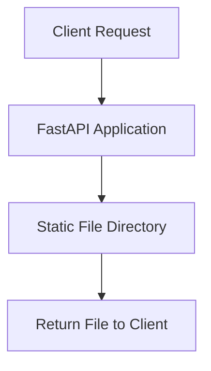

# Other — _s3_storage

# _s3_storage Module Documentation

## Overview

The **_s3_storage** module provides a local fake object storage solution specifically designed for BIM (Building Information Modeling) conversion smoke tests. It serves static files that are essential for testing the conversion process without the need for a real S3 storage backend.

## Purpose

The primary purpose of this module is to facilitate the testing of BIM conversion workflows by providing a controlled environment where test files can be accessed easily. This allows developers to run smoke tests without relying on external storage services, ensuring that tests are repeatable and consistent.

## Key Components

### 1. FastAPI Application

The module utilizes FastAPI to create a lightweight web server that serves static files. The application can be run using Uvicorn, which is an ASGI server for Python.

#### Running the Application

To start the FastAPI application, execute the following command in your terminal:

```powershell
python -m uvicorn app.main:app --host 127.0.0.1 --port 8002 --reload
```

This command will start the server on `localhost` at port `8002`, with the `--reload` flag enabling automatic reloading of the server upon code changes.

### 2. Static File Serving

The static files are served from the `_s3_storage/static` directory. The expected structure for the conversion smoke fixture is as follows:

```
_s3_storage/static/projects/project_demo_001/versions/version_demo_001/source.ifc
```

This structure allows the application to locate the necessary files for testing the BIM conversion process.

### 3. Dependencies

The module has the following dependencies specified in `requirements.txt`:

- `fastapi==0.111.0`: The web framework used to create the API.
- `starlette==0.37.2`: A lightweight ASGI framework that FastAPI is built upon.
- `uvicorn==0.45.0`: The ASGI server used to run the FastAPI application.

## Architecture

The architecture of the _s3_storage module is straightforward, focusing on serving static files through a FastAPI application. Below is a simple representation of the architecture:



### Execution Flow

Currently, there are no complex execution flows or internal calls within this module. The application primarily responds to incoming HTTP requests by serving files directly from the static directory.

## Integration with the Codebase

The _s3_storage module is designed to be used in conjunction with other components of the BIM conversion workflow. It acts as a mock storage solution, allowing developers to test the conversion logic without needing to interact with a real S3 service.

To integrate this module into your testing workflow, ensure that your tests point to the local server running on `http://127.0.0.1:8002` and that the expected file paths match the structure outlined above.

## Conclusion

The _s3_storage module is a vital tool for developers working on BIM conversion processes, providing a simple and effective way to test file handling without external dependencies. By serving static files locally, it streamlines the testing process and enhances development efficiency.
