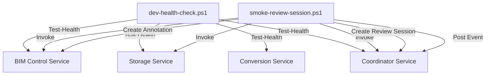

# Other — scripts

# Other — Scripts Module Documentation

## Overview

The **Other — scripts** module contains PowerShell scripts designed for health checks and smoke testing of services in a local development environment. The primary scripts included are `dev-health-check.ps1` and `smoke-review-session.ps1`. These scripts facilitate the verification of service availability and the execution of a review session for a project model.

## Purpose

- **dev-health-check.ps1**: This script checks the health status of various services (BIM control, storage, conversion, and coordinator) to ensure they are operational before starting development work.
- **smoke-review-session.ps1**: This script initiates a review session for a specified project and model version, verifies the session's configuration, and creates annotations and events related to the review.

## Key Components

### 1. dev-health-check.ps1

#### Parameters
- **BimControlUrl**: URL for the BIM control service (default: `http://127.0.0.1:8001`).
- **StorageUrl**: URL for the storage service (default: `http://127.0.0.1:8002`).
- **ConversionUrl**: URL for the conversion service (default: `http://127.0.0.1:8003`).
- **CoordinatorUrl**: URL for the coordinator service (default: `http://127.0.0.1:8004`).
- **SkipConversion**: Optional switch to skip the health check for the conversion service.

#### Functionality
- The script defines a function `Test-Health` that:
  - Accepts a service name and URL.
  - Sends a GET request to the service's health endpoint.
  - Checks the response status and logs the result.

#### Execution Flow
1. Calls `Test-Health` for each service.
2. Logs the overall health check result.

### 2. smoke-review-session.ps1

#### Parameters
- **BimControlUrl**: URL for the BIM control service (default: `http://127.0.0.1:8001`).
- **StorageUrl**: URL for the storage service (default: `http://127.0.0.1:8002`).
- **CoordinatorUrl**: URL for the coordinator service (default: `http://127.0.0.1:8004`).
- **ProjectId**: ID of the project to review (default: `project_demo_001`).
- **ModelVersionId**: ID of the model version to review (default: `version_demo_001`).
- **UserId**: ID of the user creating the review session (default: `dev_user_001`).

#### Functionality
- The script performs the following steps:
  1. Checks the health of the BIM control, storage, and coordinator services.
  2. Creates a review session by sending a POST request to the coordinator service.
  3. Validates the session configuration, ensuring required fields are present.
  4. Retrieves artifacts and issues related to the model version.
  5. Creates an annotation for the review session.
  6. Sends an event to highlight a specific issue in the review session.

#### Execution Flow
1. Health checks for services.
2. Creation of a review session.
3. Configuration validation.
4. Retrieval of artifacts and issues.
5. Annotation creation.
6. Event posting.

## Connection to the Codebase

These scripts are standalone but are designed to interact with the following services:
- **BIM Control Service**: Manages model versions and review sessions.
- **Storage Service**: Handles storage-related operations.
- **Coordinator Service**: Coordinates review sessions and events.

The scripts utilize REST API calls to communicate with these services, ensuring that they are operational and that the review process can be executed smoothly.

## Mermaid Diagram

## Conclusion

The **Other — scripts** module provides essential tools for developers to ensure that the necessary services are running and to facilitate the review process for project models. By utilizing these scripts, developers can streamline their workflow and maintain a healthy development environment.
