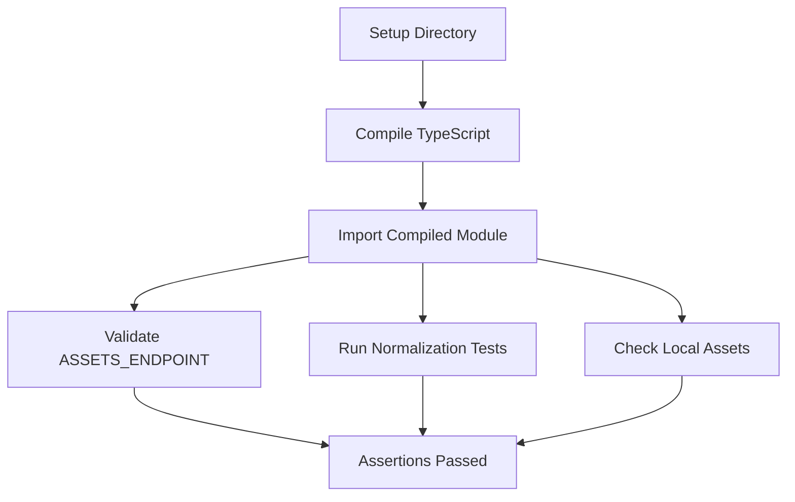

# Other — web-viewer-sample-scripts

# web-viewer-sample-scripts Module Documentation

## Overview

The `web-viewer-sample-scripts` module contains scripts that facilitate testing and validation of the assets API within the web viewer sample application. The primary script, `test-assets-api.mjs`, is responsible for compiling TypeScript assets API code, running assertions to validate the API's behavior, and ensuring that the local assets are correctly structured.

## Purpose

The main purpose of this module is to provide a testing framework for the assets API, ensuring that it behaves as expected under various conditions. This includes validating the API endpoint and normalizing asset responses.

## Key Components

### 1. Directory Setup

The script begins by setting up the necessary directories for output:

```javascript
const repoRoot = resolve(import.meta.dirname, "..");
const outDir = resolve(repoRoot, "_testoutput", "assets-api-test");
mkdirSync(outDir, { recursive: true });
```

- **repoRoot**: The root directory of the repository.
- **outDir**: The output directory where compiled assets API code will be stored.

### 2. TypeScript Compilation

The script compiles the TypeScript file `src/assetsApi.ts` into JavaScript using the TypeScript compiler (`tsc`):

```javascript
execFileSync(
  "npx",
  [
    "tsc",
    "--module",
    "NodeNext",
    "--moduleResolution",
    "NodeNext",
    "--target",
    "ES2020",
    "--skipLibCheck",
    "--strict",
    "--outDir",
    outDir,
    "src/assetsApi.ts",
  ],
  { cwd: repoRoot, stdio: "inherit", shell: process.platform === "win32" }
);
```

- **Compilation Options**: The script specifies various options for the TypeScript compiler, including module resolution and target ECMAScript version.

### 3. Importing Compiled Module

After compilation, the script imports the compiled module to access the `ASSETS_ENDPOINT` and `normalizeUSDAssetsResponse` function:

```javascript
const compiledModule = resolve(outDir, "assetsApi.js");
const {
  ASSETS_ENDPOINT,
  normalizeUSDAssetsResponse,
} = await import(pathToFileURL(compiledModule).href);
```

### 4. Assertions

The script performs a series of assertions to validate the behavior of the assets API:

- **Endpoint Validation**:
  ```javascript
  assert.equal(ASSETS_ENDPOINT, "/api/assets");
  ```

- **Response Normalization Tests**:
  ```javascript
  assert.deepEqual(
    normalizeUSDAssetsResponse([
      { name: "Model A", url: "C:/models/a.usdc" },
      { name: "Missing URL" },
      { url: "C:/models/missing-name.usdc" },
    ]),
    [{ name: "Model A", url: "C:/models/a.usdc" }]
  );
  ```

- **Invalid Input Handling**:
  ```javascript
  assert.deepEqual(normalizeUSDAssetsResponse({ assets: "invalid" }), []);
  ```

### 5. Local Assets Validation

The script checks for the existence of local assets and validates their structure:

```javascript
const localAssetsPath = resolve(repoRoot, "public", "api", "assets");
assert.equal(existsSync(localAssetsPath), true, "public/api/assets should exist as local dev fallback");

const parsedLocalAssets = JSON.parse(readFileSync(localAssetsPath, "utf8"));
assert.ok(
  normalizeUSDAssetsResponse(parsedLocalAssets).length > 0,
  "public/api/assets should contain at least one valid asset"
);
```

## Execution Flow

The execution flow of the `test-assets-api.mjs` script is linear, starting from directory setup, moving through TypeScript compilation, importing the compiled module, and finally executing assertions.



## Conclusion

The `web-viewer-sample-scripts` module is essential for ensuring the reliability of the assets API in the web viewer sample application. By validating the API's endpoint and response normalization, it helps maintain the integrity of the application as it evolves. Developers contributing to this module should focus on enhancing the test cases and ensuring that the assets API remains robust against changes.
