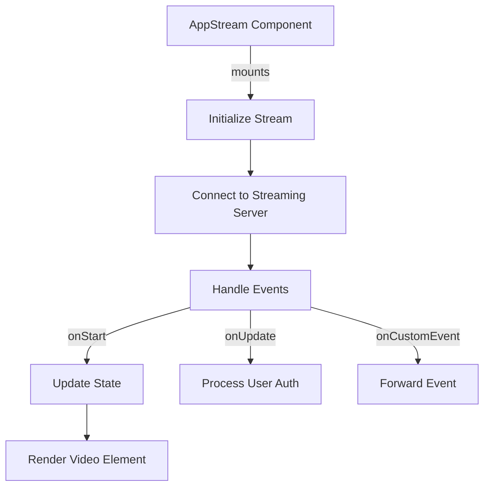

# Other — web-viewer-sample-src

# web-viewer-sample-src Module Documentation

## Overview

The `web-viewer-sample-src` module is designed to provide a web-based viewer for streaming video content, particularly in the context of NVIDIA's Omniverse platform. It leverages the `@nvidia/omniverse-webrtc-streaming-library` to facilitate real-time video streaming and interaction with various assets. This module is structured using React and includes various components for managing video streams, user interactions, and UI elements.

## Key Components

### 1. **AppStream Component**

The `AppStream` component is the core of the streaming functionality. It manages the connection to the streaming server and handles various events related to the stream lifecycle.

#### Props

- `sessionId`: Unique identifier for the streaming session.
- `backendUrl`: URL for the backend service.
- `signalingserver`: URL for the signaling server.
- `signalingport`: Port for the signaling server.
- `mediaserver`: URL for the media server.
- `mediaport`: Port for the media server.
- `accessToken`: Token for authentication.
- `style`: Optional custom styles.
- `onStarted`: Callback invoked when the stream starts successfully.
- `onStreamFailed`: Callback invoked when the stream fails to start.
- `onLoggedIn`: Callback invoked when a user logs in.
- `handleCustomEvent`: Callback for handling custom events.
- `onFocus`: Callback for when the component gains focus.
- `onBlur`: Callback for when the component loses focus.

#### State

- `streamReady`: Boolean indicating whether the stream is ready for playback.

#### Lifecycle Methods

- **componentDidMount**: Initializes the stream connection based on the configuration specified in `stream.config.json`. It sets up event handlers for stream updates, starts, and custom events.
- **componentDidUpdate**: Handles updates to the component state, specifically when the stream becomes ready.

#### Methods

- `_onStart`: Handles the start event of the stream, updating the state and invoking the `onStarted` callback.
- `_onUpdate`: Processes updates from the stream, such as user authentication.
- `_onCustomEvent`: Forwards custom events to the provided handler.
- `_onStreamStats`: Monitors stream statistics and adjusts the video size accordingly.
- `sendMessage`: Static method to send messages through the streaming library.
- `stop`: Static method to stop the streaming session.

### 2. **Styling**

The module includes several CSS files that define the styles for various components:

- **App.css**: General styles for the application, including loading indicators and button styles.
- **AppStream.css**: Styles specific to the `AppStream` component, including layout and video element styles.
- **USDAsset.css**: Styles for displaying USD assets.
- **USDStage.css**: Styles for the USD stage container and its elements.

### 3. **Configuration**

The module uses a configuration file (`stream.config.json`) to determine the source of the stream (e.g., local, GFN, or stream). This configuration is critical for establishing the correct connection parameters.

### 4. **Environment Variables**

The module utilizes environment variables defined in `env.ts` to configure API endpoints and default values for the application. This allows for flexibility in deployment and testing.

## Execution Flow

The execution flow of the `AppStream` component can be summarized as follows:

1. **Initialization**: Upon mounting, the component reads the stream configuration and sets up the appropriate stream source.
2. **Connection**: The component attempts to connect to the streaming server using the `AppStreamer.connect` method.
3. **Event Handling**: The component listens for various events (start, update, custom events) and updates its state accordingly.
4. **Rendering**: The component renders the video element and other UI components based on the current state.

## Integration with the Codebase

The `web-viewer-sample-src` module integrates with the broader application by providing a streaming interface that can be embedded within other components. It communicates with other parts of the application through callbacks and event handlers, allowing for a cohesive user experience.

### External Dependencies

- **@nvidia/omniverse-webrtc-streaming-library**: This library is essential for managing the WebRTC streaming functionality.
- **React**: The module is built using React, leveraging its component-based architecture for UI management.

## Conclusion

The `web-viewer-sample-src` module serves as a robust foundation for building web-based streaming applications within the NVIDIA ecosystem. By understanding its components, lifecycle, and integration points, developers can effectively contribute to and extend its functionality.
