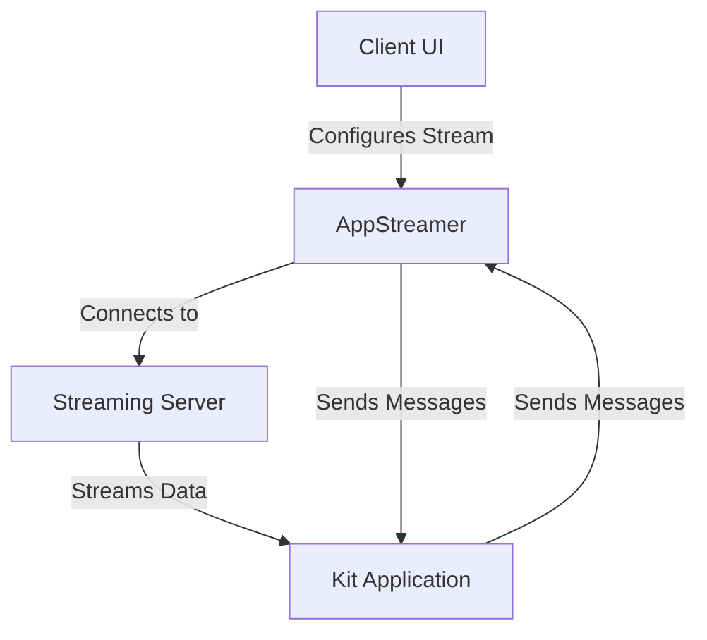

# Other — web-viewer-sample

# Omniverse Web Viewer Sample Module Documentation

## Overview

The **web-viewer-sample** module is a sample application designed to demonstrate how to stream Omniverse Kit applications to a web client. It serves as a front-end client that can present a streamed Omniverse Kit application and facilitate bi-directional messaging between the client and the application. This module supports various streaming deployments, including local streaming, Omniverse Kit Application Streaming (OKAS), and Graphics Delivery Network (GDN).

## Purpose

The primary goal of this module is to provide a reference implementation for developers looking to integrate Omniverse streaming capabilities into their web applications. It showcases how to handle streaming, user interactions, and messaging between the client and the streamed application.

## Key Components

### 1. Project Structure

The project is structured as follows:

```
web-viewer-sample/
├── src/
│   ├── App.tsx
│   ├── AppStream.tsx
│   ├── USDStage.tsx
│   └── Window.tsx
├── public/
│   └── index.html
├── stream.config.json
├── package.json
└── vite.config.ts
```

### 2. Main Files

- **App.tsx**: The main entry point of the application. It initializes the streaming session and manages the overall application state.
- **AppStream.tsx**: Contains the `AppStreamer` class, which is responsible for managing the streaming connection and handling messages between the client and the Kit application.
- **USDStage.tsx**: Manages the USD asset selection and displays the contents of the OpenUSD asset.
- **Window.tsx**: Handles user interactions and messaging with the streamed application.

### 3. Configuration

The streaming configuration is defined in the `stream.config.json` file. This file specifies the source of the stream (local, gfn, or stream) and contains necessary parameters for each type of streaming.

```json
{
    "source": "local",
    "stream": {
        "appServer": "",
        "streamServer": ""
    },
    "gfn": {
        "catalogClientId": "",
        "clientId": "",
        "cmsId": 0
    },
    "local": {
        "server": "127.0.0.1",
        "signalingPort": 49100,
        "mediaPort": null
    }
}
```

### 4. Streaming Options

The module supports three streaming options:

- **Local**: Connects directly to a running Kit application. Set the `source` field to `"local"` in the configuration.
- **Omniverse Kit App Streaming (OKAS)**: Streams Kit applications on demand. Set the `source` field to `"stream"`.
- **Graphics Delivery Network (GDN)**: Similar to OKAS but requires specific configuration parameters. Set the `source` field to `"gfn"`.

## How It Works

### Initialization

1. **Start the Kit Application**: The user must launch a streaming Kit application based on the USD Viewer Template.
2. **Clone the Repository**: The user clones the repository and installs dependencies using `npm install`.
3. **Run the Client**: The user starts the client with `npm run dev`, which serves the application on a local server.

### User Interface

Upon launching, the client presents a UI for configuring the stream settings. Users can select the type of streaming and provide necessary parameters. The UI also allows users to interact with the streamed application, including selecting USD assets and sending messages.

### Streaming and Messaging

The `AppStreamer` class in `AppStream.tsx` manages the streaming connection. It handles the following:

- **Connecting to the Stream**: The `connect()` function initializes the streaming session using the provided configuration.
- **Sending Messages**: The `sendMessage()` method allows the client to send custom messages to the streamed application.
- **Receiving Messages**: The client registers a handler for incoming messages, allowing it to respond to events from the Kit application.

### Interaction with the Streamed Application

The streamed viewport is interactive, allowing users to manipulate the camera and select objects. The client communicates with the Kit application to load USD assets and respond to user actions.

## Architecture Diagram



## Conclusion

The **web-viewer-sample** module serves as a comprehensive example for developers looking to implement streaming capabilities for Omniverse Kit applications in a web environment. By following the provided structure and utilizing the key components, developers can create their own applications that leverage the power of Omniverse streaming technology.
