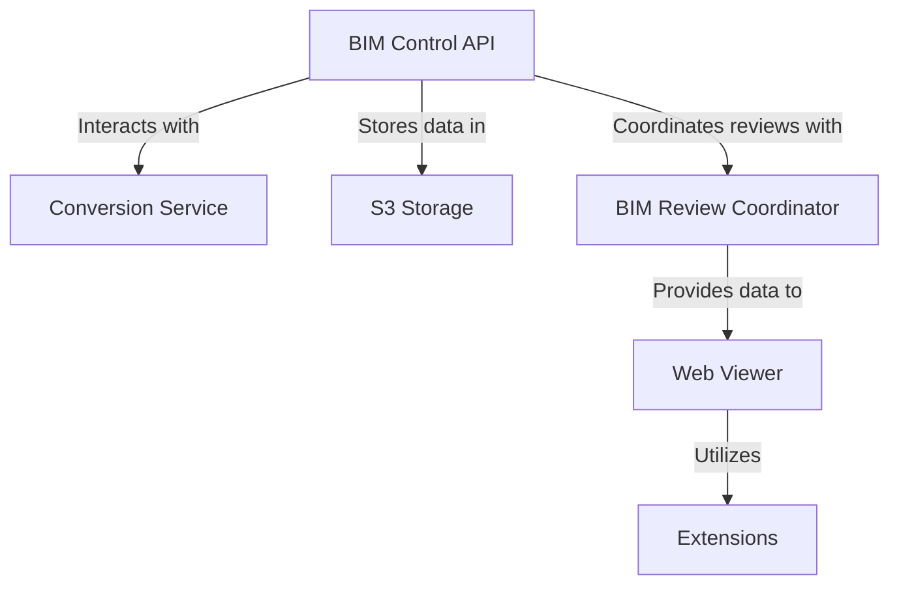

# AI-BIM-governance — Wiki

# AI-BIM-governance

Welcome to the **AI-BIM-governance** project! This repository is designed to streamline the management and collaboration of Building Information Modeling (BIM) projects through a suite of interconnected modules. Our goal is to provide developers with a robust framework that facilitates the conversion, storage, and review of BIM data, enhancing the overall workflow in architectural and construction projects.

## Project Overview

The AI-BIM-governance project consists of several key modules that work together to provide a comprehensive solution for BIM management:

- The **[BIM Control API](bim-control-api.md)** serves as the backbone of the application, offering a FastAPI-based web service for managing BIM projects, model versions, and related artifacts.
- The **[Conversion Service](conversion-service.md)** handles the conversion of IFC files to USDC format, ensuring that BIM data can be utilized across different platforms.
- The **[S3 Storage](s3-storage.md)** module simulates an S3 storage service, providing a local solution for static file storage and retrieval, which is essential for testing and development.
- The **[BIM Review Coordinator](bim-review-coordinator.md)** facilitates collaborative review sessions, allowing multiple participants to interact with BIM data in real-time.
- The **[Web Viewer](web-viewer.md)** provides a user-friendly interface for streaming applications built on NVIDIA's Omniverse platform, enabling users to manage and interact with various applications and profiles.
- The **[Extensions](extensions.md)** module allows for the integration and management of custom extensions within the Omniverse platform, enhancing its functionality.

## Architecture Overview

The architecture of the AI-BIM-governance project is designed to ensure seamless interaction between modules, allowing for efficient data flow and processing. Below is a high-level overview of the architecture:



## Key Flows

1. **BIM Data Management**: The BIM Control API manages all BIM-related resources, allowing users to create, read, update, and delete project data.
2. **File Conversion**: When an IFC file is uploaded, the Conversion Service processes it and converts it to USDC format, reporting the status back to the BIM Control API.
3. **Storage Solutions**: The S3 Storage module provides a local environment for storing and retrieving files, which can be accessed by the BIM Control API and other modules.
4. **Collaborative Reviews**: The BIM Review Coordinator manages review sessions, enabling real-time collaboration among participants, with updates reflected in the Web Viewer.
5. **User Interaction**: The Web Viewer serves as the interface for users to interact with the BIM data, leveraging the capabilities of the Extensions module to enhance functionality.

## Getting Started

To set up the project locally, follow these steps:

1. Clone the repository:
   ```bash
   git clone https://github.com/yourusername/AI-BIM-governance.git
   cd AI-BIM-governance
   ```

2. Install the required dependencies:
   ```bash
   pip install -r requirements.txt
   ```

3. Start the FastAPI server:
   ```bash
   uvicorn bim_control_api:app --reload
   ```

4. Access the API documentation at `http://localhost:8000/docs`.

We encourage you to explore the individual module documentation for more detailed information on each component. Welcome aboard, and happy coding!
