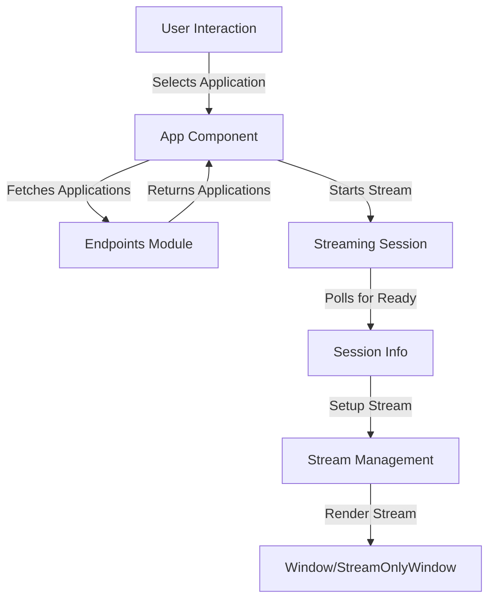

# Web Viewer

# Web Viewer Module Documentation

## Overview

The **Web Viewer** module is designed to provide a web-based interface for streaming applications built on NVIDIA's Omniverse platform. It facilitates the interaction between a client and a Kit application, allowing users to select applications, versions, and profiles, and to manage streaming sessions. The module is structured using React components and integrates with various APIs to fetch application data and manage streaming sessions.

## Purpose

The primary purpose of the Web Viewer module is to enable users to:
- Connect to a Kit application and manage streaming sessions.
- Select applications, versions, and profiles from a user-friendly interface.
- Stream content from the selected application and interact with it in real-time.

## Key Components

### 1. **App Component**

The `App` component serves as the main entry point for the Web Viewer. It manages the application state, handles user interactions, and orchestrates the streaming process.

#### Key Functions:
- **_resetState**: Resets the application state to its default values.
- **pollForSessionReady**: Polls the server to check if the streaming session is ready.
- **_startStream**: Initiates a new streaming session based on user-selected application details.
- **setupStream**: Configures the stream using the data returned from the server after a session is created.
- **_resetStream**: Ends the current streaming session and resets the application state.

### 2. **Forms for User Input**

The module includes several forms that guide the user through the process of selecting an application and its configurations:

- **AppOnlyForm**: Allows the user to choose whether to use the web UI or stream only.
- **ServerURLsForm**: Collects the URLs for the application and streaming servers.
- **ApplicationsForm**: Displays available applications fetched from the app server.
- **VersionsForm**: Lists the versions of the selected application.
- **ProfilesForm**: Allows the user to select a profile for the chosen application version.

### 3. **Endpoints Module**

The `Endpoints` module provides functions to interact with the backend APIs. It includes methods for:
- Fetching applications, versions, and profiles.
- Creating and destroying streaming sessions.
- Retrieving session information.

### 4. **Stream Management**

The module utilizes the `AppStreamer` from the `@nvidia/omniverse-webrtc-streaming-library` to manage the streaming process. It handles the signaling and media streaming required for real-time interaction.

### 5. **Window and StreamOnlyWindow Components**

These components are responsible for rendering the streaming interface. They receive configuration details such as session ID, signaling server, and media server information, and manage the display of the streamed content.

## Execution Flow

The execution flow of the Web Viewer module can be summarized as follows:

1. **Initialization**: The `App` component initializes and sets the default state.
2. **User Interaction**: The user navigates through forms to select the application, version, and profile.
3. **Session Creation**: Upon user selection, the `_startStream` function is called, which creates a streaming session.
4. **Polling for Session Ready**: The `pollForSessionReady` function checks if the session is ready and sets up the stream accordingly.
5. **Streaming**: The stream is established, and the user can interact with the application through the web interface.

## Integration with the Codebase

The Web Viewer module integrates with the broader Omniverse ecosystem by:
- Utilizing the `Endpoints` module to communicate with backend services for fetching application data and managing streaming sessions.
- Leveraging the `AppStreamer` library for handling WebRTC streaming.
- Interfacing with various components to provide a cohesive user experience, allowing for real-time interaction with streamed content.

## Conclusion

The Web Viewer module is a critical component of the Omniverse platform, enabling users to interact with applications in a web-based environment. Its architecture is designed for flexibility and ease of use, making it a powerful tool for developers and users alike. By understanding its components and execution flow, developers can effectively contribute to and enhance the Web Viewer module.
