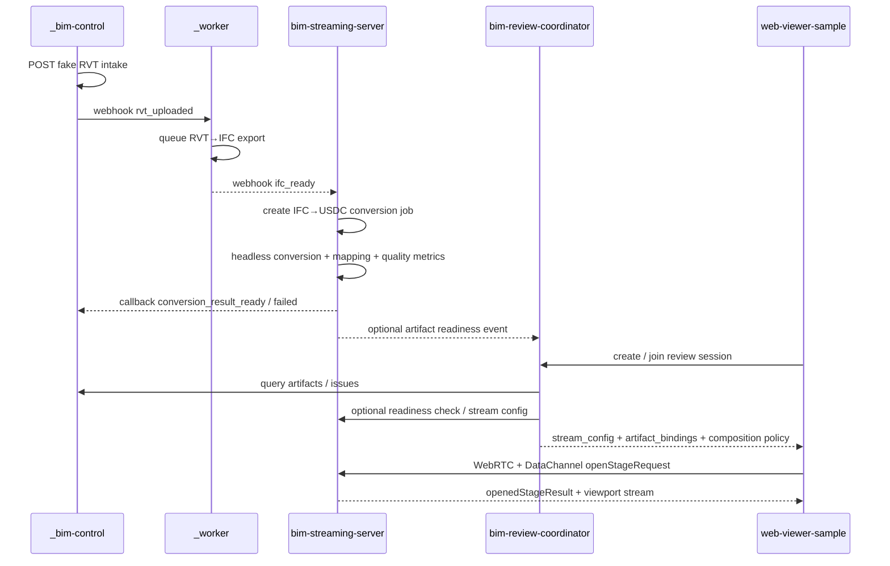

# Design: architecture-rework-2026-05-14

## 1. Decision summary

### D1. Use B 方案 for conversion ownership

`bim-streaming-server` SHALL become the authority for IFC→USDC conversion jobs.

This means:

```txt
POST /api/conversions/ifc-to-usdc        → bim-streaming-server
GET  /api/conversions/{job_id}           → bim-streaming-server
GET  /api/conversions/{job_id}/result    → bim-streaming-server
conversion job state store               → bim-streaming-server boundary
model.usdc / mapping / entity_index      → produced under bim-streaming-server boundary
```

`_worker` SHALL NOT own USDC conversion job status after this architecture is applied. `_worker` only produces IFC-ready handoff artifacts from RVT inputs.

### D2. Keep live streaming runtime separate from heavy conversion execution

Although `bim-streaming-server` owns the conversion job, the actual heavy converter SHOULD run in a headless converter app / subprocess / job lane, not inside the live WebRTC viewport runtime thread.

Allowed:

```txt
bim-streaming-server service boundary
  ├── conversion API / job store
  ├── headless IFC→USDC converter runner
  ├── artifact writer / mapping writer
  └── live Kit WebRTC runtime
```

Not allowed:

```txt
- blocking the live WebRTC viewport loop while converting a large IFC
- marking placeholder output as ready
- mixing converter-only dependencies into the live runtime app without explicit risk review
```

### D3. `bim-review-platform` is a deployment boundary

`bim-review-platform` SHALL mean an integration/deployment boundary inside the single root repo. It MAY be represented by docker-compose profiles, root scripts, or deployment docs.

It SHALL NOT create:

```txt
- nested .git
- submodule
- subtree
- hidden independent repo
```

### D4. `_bim-control` fake Revit intake does not run Revit

`_bim-control` SHALL accept a fake RVT upload / signed upload reference and publish an intake event. It SHALL NOT run Revit or consume a Revit license.

### D5. `_worker` RVT→IFC bridge owns only the export step

`_worker` SHALL manage:

```txt
rvt_received → queued → exporting_rvt_to_ifc → ifc_ready / failed
```

It SHALL NOT manage:

```txt
ifc_to_usdc_queued → converting_ifc_to_usdc → usdc_ready
```

### D6. Preserve conversion quality semantics

When conversion ownership moves to `bim-streaming-server`, these semantics MUST move with it:

- `source_ifc_entity_count`
- `mapped_count`
- `unmapped_count`
- `coverage_ratio`
- `coverage_status`
- `minimum_coverage_baseline_locked`
- `materialization_strategy`
- `sidecar_carrier_count`
- `entity_index` artifact
- no fabricated GUID mapping
- no placeholder-ready result

### D7. Coordinator decides review composition policy, streaming applies USD composition

`bim-review-coordinator` decides which model is primary and the order of secondary artifacts.

`bim-streaming-server` receives a stage composition payload and creates / opens the USD stage using:

```txt
root layer      = primary_model_A.usdc
session layer   = runtime review overrides
subLayers       = secondary_model_B.usdc, secondary_model_C.usdc, ...
```

## 2. Target service roles

| Service | New role | Does not do |
|---|---|---|
| `_bim-control` | Fake BIM data authority + fake Revit/RVT intake facade | Revit runtime, IFC→USDC conversion, WebRTC, USD runtime |
| `_worker` | Dockerized RVT→IFC export bridge + internal queue | USDC conversion job authority, Kit runtime, review session lifecycle |
| `bim-streaming-server` | IFC→USDC conversion job authority + headless converter boundary + Kit runtime/WebRTC/DataChannel | long-term business authority, user auth, review issue authority |
| `bim-review-coordinator` | Session lifecycle, Kit pool, viewport sharing, artifact binding, composition policy | conversion execution, USD internals, artifact bytes |
| `web-viewer-sample` | Browser client / WebRTC viewer / user interaction | conversion, data authority, Kit launch |
| `bim-review-platform` | Deployment/integration boundary around coordinator + streaming + viewer | nested repo, single-process assumption |

## 3. New event flow



## 4. API / webhook contracts

### 4.1 `_bim-control` → `_worker`: `rvt_uploaded`

```http
POST /api/worker/rvt-exports
```

```json
{
  "event_type": "rvt_uploaded",
  "event_id": "evt_rvt_20260514_001",
  "correlation_id": "corr_20260514_001",
  "project_id": "project_demo_001",
  "model_version_id": "version_demo_001",
  "source_artifact": {
    "artifact_id": "artifact_rvt_demo_001",
    "format": "rvt",
    "filename": "model.rvt",
    "url": "file://storage/project_demo_001/version_demo_001/model.rvt",
    "checksum_sha256": null
  },
  "requested_outputs": ["ifc"],
  "callback_url": "http://127.0.0.1:8001/api/rvt-export-results"
}
```

### 4.2 `_worker` → `bim-streaming-server`: `ifc_ready`

```http
POST /api/conversions/ifc-to-usdc
```

```json
{
  "event_type": "ifc_ready",
  "event_id": "evt_ifc_20260514_001",
  "correlation_id": "corr_20260514_001",
  "project_id": "project_demo_001",
  "model_version_id": "version_demo_001",
  "source_rvt_artifact_id": "artifact_rvt_demo_001",
  "ifc_artifact": {
    "artifact_id": "artifact_ifc_demo_001",
    "format": "ifc",
    "filename": "model.ifc",
    "url": "http://127.0.0.1:8005/objects/project_demo_001/version_demo_001/model.ifc",
    "checksum_sha256": null
  },
  "requested_outputs": ["usdc", "element_mapping", "entity_index", "quality_metrics"],
  "options": {
    "force": false,
    "allow_placeholder_ready": false,
    "allow_fake_mapping": false
  },
  "callback_url": "http://127.0.0.1:8001/api/model-versions/version_demo_001/conversion-result"
}
```

Response:

```json
{
  "conversion_job_id": "conv_stream_20260514_001",
  "status": "queued",
  "authority": "bim-streaming-server",
  "correlation_id": "corr_20260514_001"
}
```

### 4.3 `bim-streaming-server` conversion status

```http
GET /api/conversions/{conversion_job_id}
GET /api/conversions/{conversion_job_id}/result
```

Status enum:

```txt
queued
running
succeeded
failed
cancelled
```

Stage enum:

```txt
queued
fetching_ifc
indexing_ifc
converting_ifc_to_usdc
opening_usdc_for_validation
building_element_mapping
writing_entity_index
publishing_artifacts
notifying_bim_control
done
failed
```

### 4.4 `bim-streaming-server` → `_bim-control`: conversion result callback

```json
{
  "event_type": "conversion_result_ready",
  "authority": "bim-streaming-server",
  "conversion_job_id": "conv_stream_20260514_001",
  "correlation_id": "corr_20260514_001",
  "project_id": "project_demo_001",
  "model_version_id": "version_demo_001",
  "source_artifact_id": "artifact_ifc_demo_001",
  "derived_artifacts": {
    "usdc": {
      "artifact_id": "artifact_usdc_demo_001",
      "url": "http://127.0.0.1:49100/artifacts/project_demo_001/version_demo_001/model.usdc",
      "format": "usdc",
      "status": "ready"
    },
    "element_mapping": {
      "artifact_id": "artifact_mapping_demo_001",
      "url": "http://127.0.0.1:49100/artifacts/project_demo_001/version_demo_001/element_mapping.json",
      "format": "json",
      "status": "ready"
    },
    "entity_index": {
      "artifact_id": "artifact_entity_index_demo_001",
      "url": "http://127.0.0.1:49100/artifacts/project_demo_001/version_demo_001/entity_index.json",
      "format": "json",
      "status": "ready"
    }
  },
  "quality_metrics_summary": {
    "source_ifc_entity_count": 0,
    "mapped_count": 0,
    "unmapped_count": 0,
    "coverage_ratio": 0,
    "coverage_status": "not_measured",
    "materialization_strategy": "sidecar",
    "sidecar_carrier_count": 0,
    "minimum_coverage_baseline_locked": false
  }
}
```

## 5. Readiness tiers after rework

```txt
rvt_intake                    _bim-control
rvt_to_ifc_bridge             _worker
streaming_conversion_job      bim-streaming-server
mapping_quality               bim-streaming-server
coordinator_session_lifecycle bim-review-coordinator
single_kit_render             bim-streaming-server + web-viewer-sample
single_kit_multi_viewer       coordinator + streaming + viewer
usd_stage_composition         coordinator policy + streaming application
```

Each tier MUST be reported as `passed`, `failed`, `blocked`, `deferred`, or `not_observed`. A pass in one tier MUST NOT imply pass in another.

## 6. Migration strategy

### Phase A: Source-of-truth alignment only

- Land OpenSpec change.
- Update `AGENTS.md`, `README.md`, workflow, roadmap only after reviewer approval.
- No runtime code changes.

### Phase B: Contract stubs

- Add fake RVT intake endpoint.
- Add `_worker` RVT→IFC fake export / fixture mode.
- Add `bim-streaming-server` conversion API stub returning queued/blocked states.

### Phase C: Move conversion execution authority

- Move or wrap existing IFC→USDC adapter logic under `bim-streaming-server` authority.
- Preserve quality metrics, sidecar, mapping, entity index.
- Do not delete `_worker` converter code until replacement has evidence.

### Phase D: Platform integration

- Add `bim-review-platform` compose/run profile.
- Add single-Kit multi-viewer smoke.
- Add stage composition smoke.

## 7. Risk log

| Risk | Impact | Mitigation |
|---|---|---|
| Heavy converter blocks live stream | Demo/runtime stalls | Use headless converter process/job lane under streaming-server boundary |
| Loss of mapping/lineage during ownership move | AI/highlight breaks | Require quality metrics and entity_index in streaming conversion result |
| Revit license unavailable | RVT→IFC cannot run | Fake export fixture mode + blocked evidence state |
| Nested repo confusion | Git governance breaks | Define `bim-review-platform` as deployment boundary only |
| Historical worker evidence misused | False confidence | New B-scheme smoke tier required |
| Placeholder ready regression | Bad demo / fake correctness | `allow_placeholder_ready=false` default and hard fail requirement |
