## Context

現行 repo 已具備 changed-path CI、base-owned diagnostic、exact-head evidence、risk-proportional review、trusted-host merge prototype、self-referential bootstrap ledger與 canonical Linux rebuild helper，但 recurring delivery loop仍以固定 User CODEOWNER的人工 `APPROVED` review為必要條件；`merge`、Linux rebuild與 post-deploy result也沒有共同 terminal state。這讓使用者必須關注中間 GitHub gate，而不是只接收可運作的 Linux交付結果。

本 change 是 authentication／permission／merge／deploy 的 Lane G／CRITICAL 變更。它不把既有 service搬進新 owner，也不讓 candidate-controlled workflow持有 write credential；它建立 repo 外 machine trust root，並把開發、machine adjudication、merge、canonical Linux deployment與結果回報串成單一可稽核 state machine。

目前 source-of-truth 與持久資料責任如下：

| 資料 | Source of truth | 禁止事項 |
|---|---|---|
| PR、base/head、reviews、checks、merge commit | GitHub server-authoritative API | 不採信 caller手填 SHA或 candidate artifact自稱成功 |
| Machine adjudication policy／required check sources | default-branch／external trust root的 immutable policy bundle | candidate不得執行或替換 adjudicator |
| Merge credential | agent-inaccessible短效單 repo GitHub App broker | 不進 model、candidate process、command line或 artifact |
| Deployment topology／account／paths | owner-controlled repo-external `target.local.json` | repo、log與 terminal record不得保存 raw值 |
| Detailed deploy evidence | trusted deployment host的 owner-controlled artifact store | 不把 secrets、raw env或 private inventory上傳 GitHub |
| Sanitized terminal delivery truth | exact merge commit上的 external App CheckRun＋append-only delivery ledger | PR comment、exit 0或單一 HTTP回應不得單獨宣稱 `DELIVERED` |

## Goals / Non-Goals

**Goals:**

- 每個正常開發 PR皆不需要 human／CODEOWNER approval、protected-environment reviewer或固定 User service-account approval。
- 以 candidate-inaccessible、source-pinned、exact-head machine gate取代人工 merge authority。
- 以 Draft-first、head freeze、finding 批次修復與最多兩輪 exact-head review，防止 approval／check／review 無界循環。
- 將 repo-local `autonomous-pr-queue` 改為 named-PR finalization 主入口，讓 `blip-approve` 只保留 activation rollback compatibility。
- 所有風險層級都有 machine-only路徑；最高風險改走較強的 deterministic＋三層交叉對抗＋external authorization，不退回人工 approval。
- 只有 merge commit在 canonical Linux測試目標實際重建並通過適用 post-deploy gates才輸出 `DELIVERED`。
- 使用者只需查看 terminal delivery record；中間狀態可觀測但不要求使用者逐 PR操作。
- 所有 credential、private inventory與部署 topology持續在 agent／repo之外。

**Non-Goals:**

- 不建立 production CD、production rollback或 production approval policy。
- 不讓模型、PR branch、GitHub Actions candidate job或一般 agent session取得 merge／deployment write credential。
- 不使用 GitHub Web UI automation或把 automated action描述成人工審查。
- 不變更 coordinator、streaming、governance、viewer的產品 API或持久資料 ownership。
- 不保證失敗部署自動回到舊 commit；v1以 fail-closed repair cycle處理，除非後續獨立規格建立可證明的 transactional rollback。
- 不因本 change自動啟動 Lane S；`spec-to-done`仍須使用者明確呼叫。
- 不把仍在 `LEGACY_GUARDED` 下收斂的既有 PR 追溯切換到 candidate 定義的新 gate；它們依舊 protection 完成，新路徑只在 implementation 已從 `main` 提供且 activation attestation 完成後生效。

## Decisions

### D1 — 移除 review vote，而不是模擬 human approval

啟用後 branch protection的 `required_approving_review_count` SHALL為 `0`，`require_code_owner_reviews` SHALL為 `false`，`require_last_push_approval` SHALL為 `false`；CODEOWNERS僅作 ownership routing。既有 approval bot／固定 User broker從 merge critical path移除。External App required CheckRun 只有 actual `success` 可解鎖；`HELD`、evidence incomplete、head drift或publisher unavailable必須保持 absent／pending或以blocking conclusion結案，絕不得以GitHub可能視為通過的 `neutral`／`skipped` 表示。

**理由**：API／browser automation無法誠實成為「human manual review」，且保留一個虛構的人類票只會增加 credential與語意混淆。

**替代方案**：讓 `blip-approve`送 counted User review。拒絕，因它仍把 delivery authority包裝成 approval，並與 machine merge authorization重複。

Protected branch PR population採closed classification：`draft_report_only`、`ordinary`、`repair`、`reconciliation`、`activation_canary`、`activation_closure`、`revert`、`release_hotfix`。`repair`／`revert`綁定可重現失敗的delivery ID；`reconciliation`綁定merge outcome ambiguity，或在 `AUTONOMOUS_ACTIVE` 綁定 `DELIVERY_PENDING_FIXPOINT` debt與delivery ID的closure-only diff；`activation_closure`只供 `CANARY_ACTIVE` 的single-use activation tuple。每個exact tuple必須恰屬一類；zero／multi／unknown classification一律 `HELD`。所有可merge class都只有machine gate或typed `HELD`，不存在「特殊／非正常PR所以改走human approval」的逃生口；revert／release／hotfix固定走 `critical_machine_adjudication`。

### D2 — Privileged executor與 untrusted verification分離

Candidate code可在無 credential、一次性、deny-by-default egress、allowlisted input、bounded CPU／wall-clock／memory／output bytes的 verifier環境執行 affected tests；持有短效 merge token的 executor只讀 server state、immutable evidence與簽章 attestation，絕不 checkout或執行 candidate code。只有 external GitHub App可在 exact head發布 branch-protection required `autonomous-delivery-gate` CheckRun。

每份跨boundary attestation SHALL包含 `issuer_id`、`key_id`、algorithm、repo／PR／base／head、policy digest、payload digest、nonce、issued／expires timestamps與artifact content digest。Executor只接受external trust store中未過期、未撤銷且用途相符的public key／App identity；rotation採add-before-remove，revocation立即使未消費lease失效。Check、merge與deploy credential broker分離，candidate process不得繼承其中任何一種credential。

Credential-bearing deployment transport只建立target-scoped opaque lease並執行attested transport bundle；candidate-controlled helper／runtime不得讀取raw inventory、SSH material或broker environment。Canonical test target只提供test-scoped runtime identity與deny-by-default egress，禁止production secret。Artifact store reference SHALL綁定issuer、content digest、size、media type、ACL scope與retention class；executor驗證reference authentication後才可消費。

**理由**：candidate-controlled `pull_request` workflow即使同名，也不能成為自己的 merge trust root。

**替代方案**：只依賴 repo內 GitHub Actions。拒絕，因 PR可修改 workflow／script／manifest後自我證明。

### D3 — Closed exact-head adjudication packet

Machine gate輸入 SHALL綁定 `repo`、PR number、base branch／SHA、head branch／SHA、merge-base、changed-path set與digest、immutable diff digest、required-check source map、policy digest、verification manifest digest與完整 review surface digest，並由D2的attestation envelope簽章。未知欄位、缺頁、binary／submodule、head/base drift、unknown／expired／revoked signer、artifact authentication失敗或 evidence超限一律 `HELD`。

### D4 — 三層交叉對抗是最高風險 machine decision，不是票數共識

- L1 Find：按非重疊 lens找出具 path:line evidence的 findings。
- L2 Cross-refute：使用不同模型、refute-by-default；沒有成功驗證不等於 finding被推翻。
- L3 Apex synthesis：使用受治理 apex model重讀 immutable evidence、L1 survivors、L2 killed／unverified items，輸出 closed schema verdict。

任何 required layer失敗、模型／effort／prompt boundary漂移、finding evidence無法重現或仍有 unresolved HIGH／CRITICAL blocker，結果 SHALL為 `HELD`。`mechanical_only`可依 policy使用零 model reviewer，但 deterministic gate仍不可省略。原 `human_critical`語意將改名／遷移為 `critical_machine_adjudication`；它提高 machine gate強度，不要求逐 PR人類審批。

### D5 — Merge sink只接受 exact head且重新讀取所有狀態

Privileged executor在 verdict後取得single-use merge-authorization lease；lease綁定repo／PR／base／head、protection／ruleset epoch與digest、required-check sources、conversation state、policy／evidence digests、nonce與短expiry。所有owner-controlled protection／ruleset mutation必須經同一external broker序列化；out-of-band epoch drift視為incident並停用sink。Executor在lease內重新讀取全部狀態，GitHub仍以branch protection原子強制required checks、conversation resolution與exact head，全部一致才可呼叫GitHub Pull Request Merge REST endpoint，request body綁定 `sha=<preparedHead>`。PUT response後仍須bounded authoritative reread確認相同PR已merge、取得有效merge commit且settings epoch未漂移；任何非head state race或結果歧義都不得被猜測為成功。

### D6 — 每 repo單一 delivery lock，完成定義後移

同一 repo同時只允許一個 `merge → deploy → verify` delivery transaction。上一個 merge commit尚未以D8的closed terminal schema結案時，`ordinary` PR不得進入 merge sink；`HELD/MERGE_OUTCOME_UNVERIFIED` 或 `HELD/DELIVERY_PENDING_FIXPOINT` 只允許明確綁定相同lineage的 `reconciliation` PR，`FAILED/MERGED_NOT_DELIVERED` 只允許綁定相同failure delivery ID的 `repair`／`revert` PR。其他post-merge `HELD`不開放任何PR進入sink；只有 `DELIVERED`釋放 `ordinary` queue。這避免多個未驗證 merge在 canonical target疊加後失去歸因。

### D7 — Canonical Linux deployment只消費 freshly fetched origin/main

Merge observation成功後，trusted deployment host以 repo-external inventory解析唯一 `role=canonical_test_deploy` Linux target，執行既有 operator entry：

```powershell
.\scripts\dev\rebuild-test-deploy.ps1 -Build -InventoryPath '<repo-external target.local.json>'
```

Helper必須重新fetch `+refs/heads/main:refs/remotes/origin/main`，並證明fresh `origin/main`與deployed commit都**完全等於**該delivery的merge commit。只要main多出其他commit、first-parent不相等、out-of-band ref movement或target readback不相等，就以settings／attribution drift `HELD`，不得用ancestor包含關係放寬。未merge branch、stale ref、`local-windows`、`-DryRun`、`-Force`與替代啟動命令皆不能產生 `DELIVERED`。

Runner分工是閉合contract：Linux trusted runner負責transport、build、service health、Linux API／integration、Kit／WebRTC與artifact readback；Windows protected runner負責pre-merge Chromium DPR1 design gate，並在post-deploy透過owner-approved跨網段通道對相同non-secret target ID執行browser operability。兩者的runner identity、target identity、fixture、runtime ID與artifact digest都必須進terminal packet；任一required runner或network path unavailable即 `HELD`，不得以另一runner或partial evidence代替。

### D8 — Terminal result以實際 Linux outcome為準

Transaction使用兩層closed schema，禁止把internal reason冒充公開結果：

```text
phase: COLLECTING -> VERIFYING -> READY_TO_MERGE -> MERGING -> MERGED
       -> DEPLOYING -> VERIFYING_DEPLOYMENT -> [RETRYING_DEPLOYMENT] -> CLOSED

terminal_class (only when CLOSED): DELIVERED | FAILED | HELD
reason_code (closed v1):
  DELIVERY_VERIFIED
  PREMERGE_EVIDENCE_INVALID
  PREMERGE_AUTHORITY_UNAVAILABLE
  POLICY_OR_SETTINGS_DRIFT
  MERGE_OUTCOME_UNVERIFIED
  DEPLOYMENT_BLOCKED
  MERGED_NOT_DELIVERED
  DELIVERY_PENDING_FIXPOINT
  ACTIVATION_UNATTESTED
```

`DELIVERED`只可搭配 `DELIVERY_VERIFIED`，並要求exact merge／origin-main／deployed commit相等、deploy exit 0、target identity digest、service health、適用verification plan全部成功，以及sanitized result由external App發布在exact merge commit。可重現的post-merge build／verification failure以 `FAILED/MERGED_NOT_DELIVERED`結案；authority、evidence、runner、settings、merge outcome或fixpoint無法證明時以 `HELD/<matching reason>`結案。細節只進namespaced `failure_detail`，不得擴充terminal enum。`MERGED`永遠不是完成。

Queue語意亦固定：pre-merge `HELD`不造成main mutation並使該exact tuple不可merge；`HELD/MERGE_OUTCOME_UNVERIFIED` 與 `HELD/DELIVERY_PENDING_FIXPOINT` 凍結普通queue且只開放綁定相同lineage的reconciliation lane；`FAILED/MERGED_NOT_DELIVERED` 凍結普通queue且只開放綁定failure delivery ID的repair／revert lane；其他post-merge `HELD`不開放任何PR進入sink。只有 `DELIVERED`釋放普通queue。任何新增phase、terminal class或reason code都需要新的OpenSpec delta。

Failure mapping互斥且依merge boundary分段：pre-merge Windows design／semantic authority、runner或required network path不可取得或不可驗證，一律 `HELD/PREMERGE_AUTHORITY_UNAVAILABLE`；merge後尚未以authenticated input啟動canonical target command（inventory／target／runner／network／artifact不可取得或不可驗證）一律 `HELD/DEPLOYMENT_BLOCKED`；GitHub merge outcome歧義一律 `HELD/MERGE_OUTCOME_UNVERIFIED`；已在exact commit與attested target上啟動的 `deploy.ps1 -Build` 回傳nonzero，或required post-deploy gate產生可重現negative conclusion，一律 `FAILED/MERGED_NOT_DELIVERED`；只有所有required gates positive才是 `DELIVERED/DELIVERY_VERIFIED`。同一事件不得二選一，producer不得把pre-merge authority failure映射成post-merge deployment blocker。

### D9 — 失敗觸發 bounded repair，不改寫歷史

部署或post-deploy失敗後，系統以 `FAILED/MERGED_NOT_DELIVERED`保留原始merge與deploy evidence，建立綁定delivery ID的repair或revert task／PR；同一exact commit只允許一次deterministically classified transient redeploy。需要code change或retry失敗時直接進repair／revert lineage；後續evidence loop遵守兩輪上限，只有新證據、新假設或新方法才允許第三輪，否則以typed `HELD`結案且不開放任意PR。v1不得把舊commit ad hoc reset成「成功」。Canonical Linux port／process blocker只有在啟動 `deploy.ps1` 前的唯讀preflight被發現時才是 `HELD/DEPLOYMENT_BLOCKED`；transport不得自動停止、signal或restart owner runtime。Command一旦在authenticated target啟動後回傳nonzero，仍唯一映射 `FAILED/MERGED_NOT_DELIVERED`。

### D10 — Self-referential change由 repo外 trust root裁決

變更 `.github/**`、merge／verification／deploy scripts、contracts、manifest、CODEOWNERS或本 gate時，candidate仍不能執行自己的 adjudicator。External trust root使用已啟用的 immutable policy bundle分析 candidate；該 PR另建立 self-referential bootstrap ledger entry，merge後以新機制重跑 fixpoint。外部 trust root無法驗證新 surface時 `HELD`，不退回人工 approval或 admin bypass。在 `AUTONOMOUS_ACTIVE`，fixpoint authority／evidence／command無法啟動時以 `HELD/DELIVERY_PENDING_FIXPOINT`結案，並只開放綁定該debt與delivery ID、只改ledger及該entry evidence refs的 `reconciliation` closure；fixpoint command已啟動且得到可重現negative conclusion時以 `FAILED/MERGED_NOT_DELIVERED`結案，轉入綁定failure delivery ID的repair／revert lineage。

### D11 — 一次性 activation採 add-before-remove

Activation有唯一phase與trust root，不宣稱在舊human gate仍存在時已證明machine-only merge：

1. `LEGACY_GUARDED`：本change與mechanism implementation PR仍依現行canonical gate merge；external App、trusted verifier／executor、artifact store與deployment runner建立完成，但machine sink disabled。
2. `SHADOW_DUAL`：完成credential／ACL／signer／policy／required-source negative matrix；先加入external CheckRun並觀察shadow runs，舊gate仍是唯一merge authority。
3. `CUTOVER_ARMED`：owner-controlled broker取得settings lease，保存exact rollback snapshot；machine sink仍disabled。一次性將required approval count調為0、停用CODEOWNER requirement與User approval broker，立即authoritative reread。
4. `CANARY_ACTIVE`：activation plan預先綁定一個disposable `activation_canary` exact tuple；它 `DELIVERED` 後，broker才可由authoritative canary merge commit與open debt導出一個single-use `activation_closure` exact tuple。Closure changed paths只允許 `scripts/self-referential-bootstrap-ledger.json` 與該closed entry新／更新的 `docs/evidence/**/self-referential-bootstrap/**` refs，一次只關oldest open root，不得修改其他mechanism。兩個tuple依序各自走machine-only REST CAS與exact-commit delivery，任何其他PR無lease。
5. `AUTONOMOUS_ACTIVE`：canary與closure delivery皆為 `DELIVERED`、ledger fixpoint closed、settings reread持續相等後，才開放一般PR。
6. 任何cutover／canary失敗：先disable sink、撤銷未消費lease與短效credential，再由owner broker依exact snapshot恢復 `LEGACY_GUARDED`，輸出 `HELD/ACTIVATION_UNATTESTED`；不得把rollback描述為active mode的人類fallback。

這個bootstrap需要owner一次性provisioning／settings mutation，但不是未來每PR的審批動作。進入 `AUTONOMOUS_ACTIVE` 後若trust root失效，只能disable sink與 `HELD`；不得靜默恢復逐PRhuman approval或較弱auto-merge。

### D12 — 結果報告只揭露交付需要的證據

Terminal record至少包含delivery ID、PR、base/head、merge commit、deployed origin/main commit、target ID（非host/user/path）、Linux／Windows runner identities、build result、service health、runtime IDs、適用E2E結果、attestation issuer／key ID、artifact content digests、redacted artifact links、known gaps、phase、terminal class與reason code。Raw token、private inventory、env value、proxy／CA內容、host/user與內部路徑不得出現在GitHub或對話回報。

### D13 — PR finalization採 Draft-first、head freeze與最多兩輪

Named PR在draft期間只建立advisory report、累積findings與執行可重複的affected checks，不得發布passing merge gate。Author將PR標為ready時，coordinator先完成base update與scope確認，再凍結current candidate head；凍結後禁止夾帶無關改動、逐條finding各自push或讓另一個writer修改同一head。

Finalization round定義為「對一個immutable exact head完成完整pagination、deterministic gates、適用machine review與finding disposition」：

1. Round 1在第一個frozen head一次收齊全部confirmed in-scope blockers；若沒有blocker且所有merge gates通過，finalizer直接進D5。若有修復，coordinator只推送一個batch repair head，所有舊check／review／thread evidence立即失效。
2. Round 2只review該batch repair exact head。若零blocker、required App CheckRun為actual `success`、required checks全為policy允許的actual success且unresolved threads為零，finalizer在同一single-use lease內直接進D5 compare-and-swap merge，不再等待approval vote或額外quiet period。
3. Round 2仍有confirmed blocker、pagination／evidence不完整、head再次漂移、發生第三個candidate head需求，或無法維持single-writer freeze時，transaction以 `HELD/PREMERGE_EVIDENCE_INVALID`結案，並在namespaced `failure_detail`記錄 `review_round_budget_exhausted`、`head_freeze_broken` 或具體缺口。不得busy-loop、逐finding push或自動開第三輪；只有新的使用者啟動與新的scope／evidence／hypothesis可建立新transaction。

Round budget只計算ready後的frozen exact-head review；draft探索不計入。Base drift、required source drift或settings drift不消耗「修復機會」，但會立即使當前packet／lease失效並 `HELD`，重新啟動仍需新的server-authoritative tuple。

**理由**：長時間循環不是因為approval數不足，而是finding、push、check與review沒有共同的收斂邊界；把完整收集、單次批修、第二輪確認與merge綁成一個closed transaction才能消除抖動。

**替代方案**：每個finding立即修復／push並重跑，或允許approval後再補一個last push。拒絕，因兩者都會讓exact-head evidence反覆失效，重新製造原問題。

### D14 — Skill主路徑跟隨新authority，但不把安裝狀態寫成產品真相

Repo-local `.claude/skills/autonomous-pr-queue` 與 `.codex/skills/autonomous-pr-queue` SHALL維持byte-identical，並改為一個named PR的D13 finalization入口：Draft-first、freeze、兩輪budget、complete pagination、source-pinned check、exact-head lease與立即merge。它不得再把 `blip-approve`、masked PAT prompt或固定 reviewer vote列為routine required sub-skill。

Repo-local `blip-approve` mirrors SHALL明示為 `LEGACY_GUARDED` rollback／manual compatibility；在 `CANARY_ACTIVE`／`AUTONOMOUS_ACTIVE` 不得由一般ship／merge／收斂語句自動觸發，也不得被queue manager當作merge prerequisite。`pr-queue-manager`／相關routing與 `agent-skills-manifest.json` 一併更新，mirrors與manifest digest不一致即fail closed。

Skill變更依writing-skills TDD進行：先以baseline skill跑pressure scenarios並保存其錯誤選擇（仍要求masked token、沿用stale SHIP、把`neutral`／`skipped`當pass、超過兩輪、混用review／merge credential、雙controller、incomplete pagination pass），再最小化修改skill並重跑相同scenarios。Repo source landing不代表user-level或ProgramData安裝已更新；user-level `ai-bim-pr-queue` 的routing與其他global installation必須在merge後依maintenance流程另行stage／apply／verify／rollback。

### D15 — Finding resolution代表完成 disposition，不代表一律修 code

CI、deterministic validator、machine reviewer與human reviewer產生的每個finding都進入closed disposition registry，由merge queue agent（同時扮演Review Disposition Agent）依exact-head packet與immutable policy裁決為 `ACCEPTED`、`FIX_REQUIRED`、`FALSE_POSITIVE`、`DEFERRED` 或 `ESCALATE`（舊值 `FIX`／`REJECT`／`ACCEPT_RISK`／`DEFER` 正規化為對應值）。`ACCEPTED`要求confirmed且已由current head既有commit處理或屬policy明定的non-blocking severity；`FIX_REQUIRED`要求confirmed、in-scope，且只有repair head、regression evidence與independent re-review reference同時存在才算已修復；`FALSE_POSITIVE`要求finding已被可重現evidence refute；`DEFERRED`要求confirmed但out-of-scope，並綁定同repo follow-up Issue；`ESCALATE`用於超出autonomous authority或security／ACL／architecture／schema migration／deployment／production／credentials risk class，該PR不再autonomous-merge。P0／P1／P2／BLOCKER／CRITICAL／HIGH若confirmed且in-scope，一律只能 `FIX_REQUIRED` 或 `ESCALATE`。

每個disposition都以structured GitHub reply留在對應thread：人類可讀理由、evidence位置、next action，加上隱藏machine-readable metadata（`<!-- ai-bim-review-disposition/v1 {...} -->`）綁定finding_id、thread_id、head_sha、base_sha、agent_run_id、sender、webhook_event_id、disposition、severity、risk class、verification與evidence fingerprint。完整tuple是idempotency key；帶marker的comment永遠不是finding intake，rendered body不得含reviewer-bot mention，因此agent不會遞迴觸發自己或其他reviewer。`manage-pr-queue.mjs dispose` 只渲染（read-only observer），`post-review-disposition.mjs` sink以owner identity發布並在每次mutation前後重讀exact PR tuple。

只有完整server pagination、每個finding均有合法disposition、所有對應thread已resolve且unresolved count為零，才算review convergence。Thread resolution的machine語意是「finding裁決生命週期已完成」，不是「一定有code diff」；任何「fixed」留言本身都不是merge evidence。Source-pinned App的machine success必須在convergence之後、對相同frozen head發布，且必須是expected source在該head的最新CheckRun；先前head、先發布的gate、被較新rerun取代的舊success或不完整thread集合都不得進merge preparation。

**理由**：GitHub只知道conversation是否resolved，無法分辨false positive、accepted non-blocking risk與真正blocking bug。把disposition做成closed executable contract，才能保留zero-unresolved保護，又不把所有finding錯誤耦合成code修改。

**替代方案**：任何unresolved thread都要求修改code，或只靠comment文字說明後resolve。拒絕；前者造成無界修補，後者無法機器驗證severity、evidence、scope與gate順序。

## Implementation acceptance baseline — Finding disposition、convergence、熔斷與 Subagent merge

下圖是此change的版本控制狀態機正本。圖中的「machine gate」是source-pinned external App的approval-equivalent gate，不是human／CODEOWNER review。任何unknown、缺頁、stale evidence、authority unavailable或非法transition都必須進入同一個高可見度 `HELD (FAIL-CLOSED)` terminal；不得跳過、降級或沿用舊head。

```mermaid
flowchart TB
    subgraph INPUTS[Finding inputs]
        CI[CI checks]
        AI[AI reviewer]
        SCAN[CodeQL / scanners]
        TEST[Test results]
        OTHER[Other deterministic tools]
    end

    INPUTS --> NEW[Create finding<br/>ID / source / severity / location / rule]
    NEW --> VERIFY{Finding verified?}
    VERIFY -->|confirmed + in scope| FIX[FIX_REQUIRED<br/>repair head + regression evidence + independent re-review]
    VERIFY -->|refuted| REJECT[FALSE_POSITIVE<br/>reproducible counter-evidence]
    VERIFY -->|confirmed + already on head / policy non-blocking| ACCEPT[ACCEPTED<br/>policy rule + bounded rationale]
    VERIFY -->|confirmed + out of scope| DEFER[DEFERRED<br/>same-repo follow-up Issue]
    VERIFY -->|high-risk class / outside authority| ESCALATE[ESCALATE<br/>structured reply, thread stays open]
    VERIFY -->|unverified / unknown| HELD
    ESCALATE --> HELD

    FIX --> REPLY[Structured GitHub reply<br/>hidden metadata: finding_id / head_sha / agent_run_id / sender / webhook_event_id]
    REJECT --> REPLY
    ACCEPT --> REPLY
    DEFER --> REPLY
    REPLY -->|duplicate tuple / same disposition on head / own marker| SKIP_DUP[Skip: idempotent, no recursion]
    REPLY --> EVIDENCE[Exact-head evidence validation]
    EVIDENCE -->|missing / stale / secret / invalid mapping| HELD
    EVIDENCE --> CONVERGE{Complete pagination?<br/>All findings dispositioned?<br/>Threads resolved and count = 0?}

    subgraph BUDGET[Bounded convergence circuit breaker]
        DRAFT[ROUND 0<br/>Draft advisory only]
        R1[ROUND 1<br/>Frozen head full batch]
        REPAIR[One batch repair head]
        R2[ROUND 2<br/>Final review]
        BREAK[CIRCUIT_BREAK<br/>residual blocker / third head / oscillation]
        DRAFT --> R1 --> NEW
        REPAIR --> R2 --> NEW
    end

    CONVERGE -->|NO + ROUND 1 blockers| REPAIR
    CONVERGE -->|NO + ROUND 2 blocker| BREAK
    BREAK --> HELD
    CONVERGE -->|YES| GATE[Source-pinned machine gate<br/>actual success after convergence]
    GATE -->|neutral / skipped / wrong source / stale head| HELD
    GATE -->|actual success on frozen head| PLAN[Subagent merge plan<br/>authenticated artifact + dependency graph<br/>server-observed exact heads + topological order]

    PLAN -->|human-authored / unattested / head drift / dependency inversion / missing proof| HELD
    PLAN -->|SKIP_SUBSUMED| SKIP[Do not merge redundant PR]
    PLAN -->|valid subagent order| CAS[External single-use lease<br/>exact-head CAS merge]
    CAS -->|authority or tuple drift| HELD
    CAS -->|merged| DEPLOY[Canonical Linux delivery<br/>fresh origin/main = merge commit]
    DEPLOY -->|authority / observation unknown| HELD
    DEPLOY -->|deterministic build / runtime / E2E failure| FAILED[FAILED<br/>MERGED_NOT_DELIVERED<br/>NO further merge]
    DEPLOY -->|all required evidence passes| DELIVERED[DELIVERED]

    HELD[HELD<br/>FAIL-CLOSED<br/>NO machine gate / merge / delivery]

    classDef held fill:#7f1d1d,color:#ffffff,stroke:#ef4444,stroke-width:5px;
    classDef failed fill:#991b1b,color:#ffffff,stroke:#f97316,stroke-width:4px;
    classDef guarded fill:#fff7ed,color:#9a3412,stroke:#f97316,stroke-width:2px;
    classDef success fill:#14532d,color:#ffffff,stroke:#22c55e,stroke-width:3px;
    class HELD held;
    class FAILED failed;
    class BREAK guarded;
    class DELIVERED success;
```



Machine acceptance mapping：

- `scripts/lib/autonomous-delivery-finalization.mjs` 必須拒絕非法disposition、blocking `ACCEPTED`（未在head處理）／`DEFERRED`、in-scope或跨repo `DEFERRED`、high-risk class的非 `ESCALATE` 裁決、unverified／unresolved finding、自述fixed而無repair head／regression／re-review evidence、convergence前或非expected App的machine success、非該head最新CheckRun的舊success、第三個head與無authority merge preparation。Expected CheckRun name／App ID必須由candidate bundle外的trusted verifier注入，不得self-pin。`READY_TO_MERGE` 只能由closed phase／round lineage中的 `round_converged` transition產生，且state與raw finding bundle必須同時綁定相同repository／PR／base／head；事件中的自述布林值沒有authority；escalated bundle使transaction以 `HELD` 結案。
- `classifyReviewSurface` 必須把diff bytes中的每個source／destination path與changedFiles surface逐一綁定，任一方多出或缺少即 `unsupported_review_surface`；`validateAdversarialDecision` 必須要求L1／L2／L3各自綁定同一packet digest，L2綁定exact L1 output digest，L3綁定L1與L2 output digest；`buildExactHeadMergeRequest` 必須在invalid clock時fail closed；single-flight ledger必須admit `release_hotfix`，並在FAILED／HELD後只開放綁定terminal delivery ID的repair／revert／reconciliation lane。
- Review Disposition Agent：`manage-pr-queue.mjs dispose` 只在exact-head snapshot與packet tuple相同時渲染reply與隱藏metadata（否則 `HELD`）；`post-review-disposition.mjs` 必須拒絕credential override env、非owner identity、head drift、已resolved thread、缺finding comment、readback mismatch與unparseable既有metadata，並以完整tuple與同head同disposition去重；`selectFindingIntake` 必須排除帶marker的comment；rendered body不得含reviewer-bot mention。`scripts/tests/test-review-disposition-sink.mjs` 是此sink的repo-local executable regression baseline。
- `validateSubagentMergePlan` 必須只接受 `generatedBy.kind=subagent`、外部驗證的result artifact、完整authoritative server exact-head observations、由coordinator另行供給的authoritative dependency graph（digest必須等於plan的 `dependencyGraphSha256`，每個entry的predecessor set必須等於完整authoritative edge set並將skipped PR重指向其subsumer，proof digest必須可由tuple重算）、predecessor先於successor的拓撲順序，以及綁定已保留successor、proof可重算且由trusted subsumption verifier確認的 `SKIP_SUBSUMED`；缺provenance／subsumption verifier、human-authored order、head drift、omitted edge與dependency inversion一律fail closed。
- 每次predecessor merge後，後續PR的base/head/checks/threads與plan evidence都必須重新收集；舊merge plan只能作排序候選，不是merge authority。
- `scripts/tests/test-autonomous-delivery-finalization.mjs` 是此圖的repo-local executable regression baseline；external App、GitHub settings、privileged merge與canonical Linux live evidence仍須依activation matrix另行attest。

## 三層對抗驗收 rubric（G1–G12）

| ID | 必須證明的 pass condition | Fail-closed 結果 |
|---|---|---|
| G1 | 三份既有capability以明確MODIFIED／REMOVED delta收斂，activation phase決定舊／新正本 | `HELD/POLICY_OR_SETTINGS_DRIFT` |
| G2 | pre-merge required／security／Windows design gates決定merge eligibility；post-merge canonical Linux結果決定delivery | 缺任一層不得 `DELIVERED` |
| G3 | Closed PR population全數只有machine path／typed HELD；Draft-first finalization維持single-writer head freeze、完整finding batch與最多兩輪；只有一次性owner bootstrap，`AUTONOMOUS_ACTIVE`後無per-PR human／CODEOWNER approval | `HELD/ACTIVATION_UNATTESTED` |
| G4 | App、signer、policy與executor對candidate／agent不可修改、不可取credential，且live attested | `HELD/PREMERGE_AUTHORITY_UNAVAILABLE` |
| G5 | deterministic gate先行，required machine layers獨立且unavailable fail closed；App required check只有actual `success`可解鎖，`neutral`／`skipped`不得承載HELD | `HELD/PREMERGE_EVIDENCE_INVALID` |
| G6 | settings lease、final reread、GitHub server enforcement、REST `sha` CAS與post-reread全綁exact tuple；passing final head不再等待approval或額外push | `HELD/MERGE_OUTCOME_UNVERIFIED` |
| G7 | PR head精確歸因至observed merge commit，且 `merge commit = fresh origin/main = deployed commit`；single-flight無額外commit | `HELD/POLICY_OR_SETTINGS_DRIFT` |
| G8 | owner inventory唯一解析canonical Linux；fresh fetch＋唯一operator entry；禁止Windows／stale替代與transport自動停止owner runtime | `HELD/DEPLOYMENT_BLOCKED` |
| G9 | build、health、適用API／integration／browser／Kit與artifact readback全部可歸因 | 缺一項不得 `DELIVERED` |
| G10 | 一次same-commit transient retry、queue freeze、repair／revert lineage與append-only failure | `FAILED/MERGED_NOT_DELIVERED` |
| G11 | previous mechanism裁決opening、immutable debt、`CANARY_ACTIVE` ordered canary＋`activation_closure`，以及 `AUTONOMOUS_ACTIVE` 綁定debt的 `reconciliation` closure；new mechanism重驗與fixpoint closure | `HELD/DELIVERY_PENDING_FIXPOINT` |
| G12 | lossless review surface、signer／credential／runner／artifact／egress與test-only deployment sandbox全部attested | `HELD/PREMERGE_AUTHORITY_UNAVAILABLE` |

L1、L2與L3 SHALL逐項輸出 `pass|fail|uncertain`及path:line evidence；任一G1–G12為 `fail` 或 `uncertain` 時，L3不得給activation-ready verdict。

## Live activation acceptance matrix

每次activation先產生signed `activation-plan`，至少含phase、exact command／command ID、responsible external authority、pre-state digest、expected server-authoritative observation、redacted artifact schema、pass condition、failure terminal result與rollback command ID。Private topology／credential只由owner broker解析，不進plan。

| Phase | Authoritative observation | Required sanitized artifact | Failure／rollback |
|---|---|---|---|
| `LEGACY_GUARDED` | live protection、App permissions、sink disabled | baseline settings digest＋runner／signer descriptors | 無一致baseline則停工 |
| `SHADOW_DUAL` | exact-head App CheckRuns與wrong-source rejection | negative matrix、shadow tuple、artifact digests | sink維持disabled |
| `CUTOVER_ARMED` | settings lease、approval count 0、CODEOWNER off、last-push approval off、source-pinned machine check required且只接受actual `success` | pre/post settings digests、lease ID、exact rollback snapshot digest | disable sink並依snapshot恢復legacy |
| `CANARY_ACTIVE` | pinned canary tuple後依merge commit導出的single-use closure-only tuple；兩者皆REST CAS＋exact delivery | canary packet、closure ledger／evidence-only diff、兩筆server reread | revoke lease、disable sink、`HELD` |
| `AUTONOMOUS_ACTIVE` | canary與closure皆 `DELIVERED`、fixpoint closed、settings unchanged | activation closure＋retention／revocation proof | 不開放一般PR |

## Risks / Trade-offs

- **[Machine consensus可能共享系統性偏誤]** → deterministic checks優先、跨模型L2 refutation、external L3、可重現測試高於model verdict；未存活的evidence不得merge。
- **[移除human review擴大自動化錯誤blast radius]** → delivery lock、exact-head merge、source-pinned App CheckRun、短效credential、no-admin/no-bypass與closed recovery lanes。
- **[External trust root成為高價值單點]** → immutable版本、雙快照、App/source pin、negative/positive attestation、credential隔離與fail-closed unavailable state。
- **[Self-referential trusting-trust]** → candidate inert、external policy bundle、bootstrap ledger與post-merge fixpoint；無external proof即HELD。
- **[Linux deploy可能在merge後失敗]** → `MERGED != DELIVERED`、序列鎖、完整failure record與bounded repair；v1不假造rollback。
- **[交付鎖降低throughput]** → 優先可歸因與可恢復性；未來若需要coalescing，另以spec定義`SUPERSEDED`語意，v1不跳過commit。
- **[私有topology限制可攜CI]** → public registry只保存behavior descriptor，private inventory由owner預置；transport不讀出或覆寫。
- **[bootstrap本身仍需一次owner操作]** → 明示為one-time provisioning，不宣稱「零人類初始化」；active後不再有per-PR human approval。
- **[兩輪內仍可能無法收斂]** → 第二輪blocker以typed `HELD`結案並保留完整findings，不以第三輪busy-loop換取表面通過；新transaction需要新的明示啟動與新證據／scope／hypothesis。
- **[Repo skill與user-level安裝可能漂移]** → repo mirrors＋manifest digest為source evidence；installed skill只在main landing後經global maintenance驗證，未驗證前維持legacy或 `HELD`，不得宣稱cutover完成。

## Migration Plan

1. 以本OpenSpec PR凍結machine contracts、state machine、failure taxonomy與activation gates；依舊治理完成此self-referential proposal的merge。
2. 分離實作unprivileged verifier、external CheckRun producer、privileged exact-head merge executor、delivery ledger與Linux dispatcher；每個slice先做negative tests。對repo-local skills先跑D14 pressure-scenario baseline，再修改mirrors／routing／manifest。
3. 在required human review仍存在時執行shadow adjudication與D13兩輪finalization，不進merge sink；比對至少一個routine、一個第二輪blocker、一個head drift與一個self-referential fixture。
4. Add machine required check first；完成negative live attestation與shadow source binding，建立signed activation plan及exact rollback snapshot。
5. 在settings lease內將approvals設0、CODEOWNER off、last-push approval off並停用approval broker；確認source-pinned required check只接受actual `success`。Sink仍disabled，authoritative reread相等後只開放pinned disposable canary tuple。
6. Canary以machine-only exact-head path完成merge與exact delivery；broker再導出closure-only tuple，使ledger＋該entryfixpoint evidence PR也完成machine merge與exact delivery。任一步失敗依snapshot rollback且不得宣稱active。
7. Canary與closure皆 `DELIVERED`、bootstrap fixpoint關帳且settings reread相等後啟用single-flight autonomous delivery；第一筆一般delivery需完整terminal record。

Rollback順序：disable merge sink → revoke／rotateApp capability → stop new delivery dispatch → preserve現有evidence →依exact snapshot恢復 `LEGACY_GUARDED` protection與legacy skill routing →將activation設為disabled／`HELD`。`blip-approve`只在這個legacy狀態作compatibility；不自動改寫main、不force-push、不刪除delivery history。

## Open Questions

- External runner的實體host、artifact store與retention是owner provisioning input；implementation SHALL在activation前以non-secret descriptor與live attestation解析issuer／key IDs、rotation／revocation、ACL scope、content digest、egress policy、output quota與retention class，spec不固定私有topology或secret value。
- Canonical Linux test target目前是否具備所有Kit／WebRTC post-deploy gate所需GPU與跨網段Windows browser reachability，需在positive attestation實測；缺任一適用gate時不得降級為`DELIVERED`。
